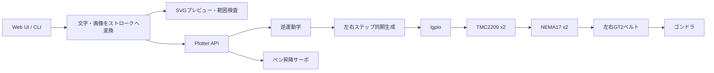
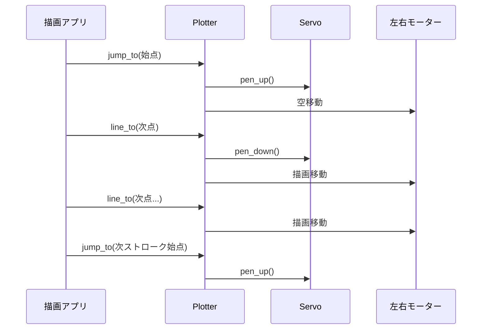
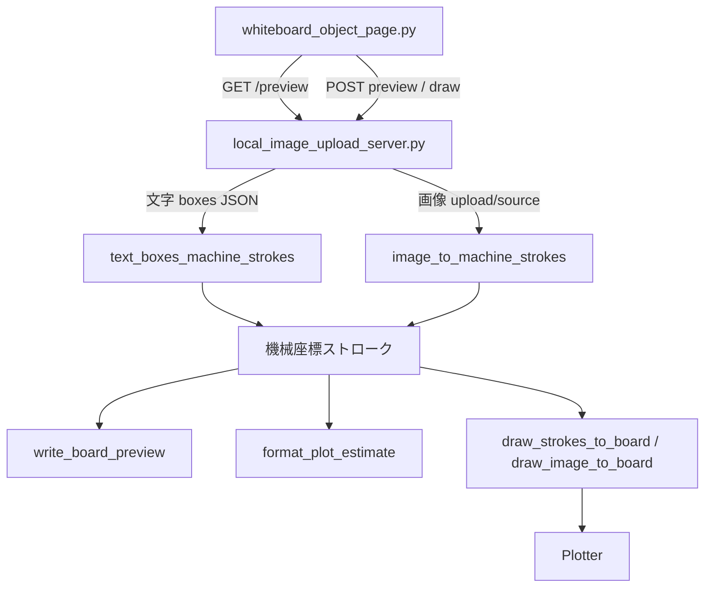

# リポジトリ構成と Plotter の仕組み

この文書は、Whiteboard V-Plotter のソフトウェア構成と、Raspberry Pi から2本のベルトを制御してペン先を動かす仕組みを説明する。

## 1. システム全体

本機は、白板上部の左右に固定した2台のステッピングモーターからベルトを垂らし、その交点にゴンドラとペンを吊るすポーラーグラフ方式のプロッターである。



通常使用する実装は `firmware/vplotter.py` の `Plotter` である。Raspberry Pi が `STEP` / `DIR` 信号とサーボPWMを直接生成する。

`firmware/wbplot.py` は別経路であり、Marlin の `POLARGRAPH` 機能を使うコントローラーへG-codeを送るための実装である。こちらでは逆運動学をMarlin側が担当する。現在のWeb UIや日本語・画像描画は、Raspberry Pi直結の `Plotter` 経路を使用する。

## 2. リポジトリ構成

```text
whiteboard-vplotter/
├── README.md                       セットアップと基本操作
├── Makefile                        OpenSCADからSTLを生成
├── config.example.py               ルート側の設定例
├── firmware/
│   ├── vplotter.py                 GPIO、運動学、補間、ペン制御、基本CLI
│   ├── config.py                   実機固有設定（Git管理外）
│   ├── config.example.py           実機設定のテンプレート
│   └── wbplot.py                   Marlin POLARGRAPH向けG-code経路
├── examples/
│   ├── meiryo_text.py              FreeTypeによる日本語輪郭描画
│   ├── image_to_svg.py             画像の二値化、輪郭抽出、描画
│   ├── local_image_upload_server.py Web APIと描画ジョブ制御
│   ├── whiteboard_object_page.py   複数テキストボックス対応Web UI
│   ├── plot_area_limits.py         描画可能領域の確認
│   ├── check_direction.py          XY方向の安全な動作確認
│   ├── two_motor.py                左右モーター単体診断
│   └── servo_test.py               ペン昇降サーボの診断
├── cad/                             OpenSCADの機構部品
├── docs/                            図面と設計文書
└── tests/                           unittestによる変換・UI・サーボのテスト
```

### 2.1 設定の読み込み

`firmware/vplotter.py` は最初に既定値を定義し、その後で `from config import *` を実行する。`firmware/` をPythonパスに追加して実行する各スクリプトでは、通常 `firmware/config.py` が読み込まれ、既定値を実機の値で上書きする。

主な設定は次のとおり。

| 設定 | 意味 |
|---|---|
| `MOTOR_SPACING` | 左右プーリー軸中心間の水平距離 |
| `HOME_X`, `HOME_Y` | 起動時に手で合わせる論理上のペン位置 |
| `AREA_X_MIN` など | 動作を許可するソフトリミット |
| `BOARD_X_MIN` など | SVGプレビュー上の白板外形 |
| `PULLEY_TEETH`, `BELT_PITCH` | 1回転で送るベルト長 |
| `STEPS_PER_REV`, `MICROSTEP` | モーターとドライバの分解能 |
| `INVERT_LEFT`, `INVERT_RIGHT` | 各モーターの配線方向補正 |
| `FEED_DRAW`, `FEED_MOVE` | 描画時と空移動時の速度 |
| `SEG_LEN` | デカルト直線の補間間隔 |
| `PIN_*` | BCM GPIO番号 |
| `SERVO_*` | ペン上下位置とランプ制御 |

`config.py` は機体固有かつGit管理外である。設定例を変更しただけでは実機動作は変わらない点に注意する。

## 3. 機械座標系

座標原点は左モーターのプーリー軸中心である。

- $X$ は右向きが正
- $Y$ は下向きが正
- 左モーターは $(0, 0)$
- 右モーターは $(D, 0)$
- $D = \texttt{MOTOR\_SPACING}$
- ペン位置は $(x, y)$

```text
左モーター (0,0)                         右モーター (D,0)
      O-------------------------------------------O
       \                                         /
        \ L                                   R /
         \                                     /
                       ● ペン (x,y)
                       ↓ +Y
             +X →
```

現在の設定例ではモーター間隔は $1900\,\mathrm{mm}$、白板は $X=50\ldots1850$、$Y=100\ldots1000$、安全描画領域は $X=250\ldots1650$、$Y=200\ldots920$ である。モーター軸が白板上端より約 $100\,\mathrm{mm}$ 上にあるため、機械座標の白板上端は $Y=100$ になる。

## 4. 逆運動学

利用者と描画データはデカルト座標 $(x,y)$ を扱うが、実際に制御できる量は左右のベルト長である。`Plotter._lengths()` はピタゴラスの定理で必要なベルト長を計算する。

左ベルト長 $L$:

$$
L = \sqrt{x^2 + y^2}
$$

右ベルト長 $R$:

$$
R = \sqrt{(D-x)^2 + y^2}
$$

1ステップあたりのベルト送り量は次式で求める。

$$
\text{MM\_PER\_STEP} =
\frac{\text{PULLEY\_TEETH} \times \text{BELT\_PITCH}}
{\text{STEPS\_PER\_REV} \times \text{MICROSTEP}}
$$

20歯、GT2の $2\,\mathrm{mm}$ ピッチ、200 full steps/rev、1/8マイクロステップの場合:

$$
\frac{20 \times 2}{200 \times 8} = 0.025\,\mathrm{mm/step}
$$

したがって理論上は $40\,\mathrm{steps/mm}$ である。`Plotter._ik_steps()` はベルト長をこの値で割り、最も近い整数ステップへ丸める。

$$
S_L = \operatorname{round}\left(\frac{L}{\text{MM\_PER\_STEP}}\right),\quad
S_R = \operatorname{round}\left(\frac{R}{\text{MM\_PER\_STEP}}\right)
$$

これは絶対ステップ位置である。移動時には現在値との差分 $\Delta S_L$, $\Delta S_R$ だけを回す。

### 4.1 なぜ逆運動学だけでは直線にならないか

デカルト空間の直線の始点と終点だけをベルト長へ変換し、左右モーターを一定比率で回しても、途中のベルト長変化は非線形なのでペン軌跡は厳密な直線にならない。

そのため `Plotter.move_to()` は移動距離を `SEG_LEN` ごとの短い区間へ分割する。区間数は概ね次の値である。

$$
N = \max\left(1, \left\lfloor\frac{\text{distance}}{\text{SEG\_LEN}}\right\rfloor\right)
$$

各補間点 $(p_x,p_y)$ を改めて逆運動学へ通し、その点に対応する左右の絶対ステップ位置まで移動する。この区分線形化により、デカルト空間の直線へ近似する。

`SEG_LEN` を小さくすると形状精度は上がるが、Python側の計算とタイミング処理が増える。大きくすると高速になる一方、長い線や描画領域端で曲線誤差が増える。

## 5. 左右モーターの同期パルス

`Plotter._run(tl, tr, duration)` は、現在の絶対ステップ位置 `(sl, sr)` から目標 `(tl, tr)` まで両モーターを同期して動かす。

1. 左右の差分 `dl`, `dr` を求める。
2. 差分の符号と `INVERT_LEFT` / `INVERT_RIGHT` からDIRピンを設定する。
3. 必要ステップ数を $a=|dl|$, $b=|dr|$ とする。
4. ループ回数を $n=\max(a,b)$ とする。
5. 各ループ $i$ で、左右それぞれの累積目標を整数除算で求める。

$$
n_L(i)=\left\lfloor\frac{a i}{n}\right\rfloor,\quad
n_R(i)=\left\lfloor\frac{b i}{n}\right\rfloor
$$

前回の累積値から増えた側だけSTEPパルスを出す。これはBresenham法に似た配分で、ステップ数の少ない側を全期間へ均等に散らす。例えば左100ステップ、右40ステップなら100回の時間スロットを作り、右パルスをその中へ40回分散する。両方が増えるスロットでは2本のSTEPを同時に立ち上げる。

`LgpioIO.pulse()` は対象STEPピンをHIGHにし、`PULSE_US` 経過後にLOWへ戻す。現在はGPIOチップ0を開き、ドライバのEnableはLOWで有効、終了時はHIGHで無効にする。

### 5.1 速度とタイミング

`move_to()` はペン状態に応じて速度を選ぶ。

- ペンが下: `FEED_DRAW`
- ペンが上: `FEED_MOVE`

移動距離を $d$、速度を $v$、補間数を $N$ とすると、1補間区間に割り当てる時間は次のとおり。

$$
t_{segment}=\frac{d/v}{N}
$$

`_run()` は区間内の最大ステップ数で時間を分け、各パルスの目標時刻を `time.perf_counter()` 基準で計算する。残り時間が長い部分は `sleep()`、最後の短い部分はbusy waitを使い、OSスケジューラの粗い待機誤差を減らしている。

この方式は専用モーションコントローラーではなくLinuxユーザー空間で動くため、リアルタイム性は限定的である。速度を上げすぎるとスケジューリング遅延、トルク不足、ベルト振動による脱調が起こり得る。

## 6. Plotter の状態と移動API

`Plotter` は次の状態を保持する。

| 状態 | 内容 |
|---|---|
| `x`, `y` | ソフトウェアが認識している現在座標 |
| `sl`, `sr` | 現在座標に対応する左右の絶対ステップ数 |
| `pen` | `True`: 下、`False`: 上、`None`: 初期状態 |
| `servo_us` | 最後に指示したサーボパルス幅 |
| `dry` | `DummyIO` 使用中かどうか |

初期化時、実機から位置を読み取る処理やリミットスイッチによるホーミングは行わない。ペンが物理的に `HOME_X`, `HOME_Y` にあると仮定し、その座標のステップ値を内部状態へ設定する。したがって電源投入時の手動位置合わせが重要である。

### 6.1 公開操作

- `jump_to(x, y)`: ペンを上げて移動する。
- `line_to(x, y)`: ペンを下げて移動する。
- `home()`: ペンを上げてHOMEへ戻る。
- `finish()`: ペンを上げ、HOMEへ戻り、ドライバを無効化してGPIOを閉じる。

`move_to()` は指定座標を `AREA_*` の範囲へクランプする。つまり範囲外命令で即座に例外を出すのではなく、境界上へ丸める。文字・画像の上位変換層では事前に全ストロークのバウンディングボックスを検査し、はみ出しをエラーにしている。

### 6.2 典型的な1ストローク



`line_to()` は毎回 `pen_down()` を呼ぶが、すでに下がっていれば何もしない。同様に `jump_to()` の連続呼び出しでも不要なサーボ動作は省略される。

## 7. ペン昇降と振動抑制

ペンはサーボのPWMパルス幅 `SERVO_UP_US` と `SERVO_DOWN_US` で上下する。目標値へ一度に飛ばすのではなく、`servo_smooth()` が小刻みに変化させる。

動作全体の進捗 $p$ に対して、1回の変化量へ次の係数を掛ける。

$$
e(p)=0.25+0.75\times4p(1-p)
$$

開始時と終了時は小さく、中央付近は大きく動く。さらに残距離が `SERVO_SLOW_ZONE` 以下になると `SERVO_SLOW_STEP_US` と `SERVO_SLOW_DELAY` を使用して着地を遅くする。

目標到達後は `SERVO_WAIT` だけ安定を待つ。`SERVO_RELEASE_AFTER_MOVE=True` の場合、`servo(0)` でPWMを停止する。サーボへ保持指令を送り続けたときに起こる微振動、発熱、ペン先の震えを抑えるためである。ただし、機構が自重で戻る場合はPWM停止が不向きなので設定変更が必要になる。

`SERVO_UP_US` に0を設定した構成では、初回のペンアップはPWM停止として扱われる。実機では上下位置に対応する有効なパルス幅を調整して使う。

## 8. GPIOバックエンドとdry-run

制御ロジックはIO実装から分離されている。

### `LgpioIO`

実機用バックエンド。`lgpio` を使ってDIR、STEP、Enable、サーボを制御する。`cleanup()` はサーボPWM停止、ドライバ無効化、GPIOチップのクローズを行う。

### `DummyIO`

PCや安全確認用バックエンド。GPIOへ触れず、`Plotter.move_to()` が座標とペン状態を `path` に記録する。`--dry` を使うCLIはこのバックエンドを選ぶ。

この分離により、逆運動学やペン状態遷移を実機なしで検証できる。ただし、脱調、ベルトの伸び、ゴンドラの傾き、摩擦などの物理誤差はdry-runでは検出できない。

## 9. 描画データの共通形式

上位層と `Plotter` の間では、描画を次の形式で表す。

```python
strokes = [
    [(x1, y1), (x2, y2), (x3, y3)],
    [(x4, y4), (x5, y5)],
]
```

- 外側のリスト: 独立したストローク群
- 1ストローク: ペンを下げたまま辿る点列
- ストローク間: ペンを上げて移動
- 座標単位: mm
- 座標系: 右向き $+X$、下向き $+Y$

文字、画像、G-code、Web UIは最終的にこの形式へ変換される。その後の範囲検査、プレビュー、時間見積、実描画を共通化できる。

## 10. 文字が描かれるまで

### 10.1 内蔵1ストロークフォント

`firmware/vplotter.py` の基本CLIは、ASCII文字を0から1の正規化座標で定義した簡易フォントを持つ。文字サイズと位置を掛けてストロークへ変換する。少ない線で高速だが、日本語や一般的なフォント形状には対応しない。

### 10.2 FreeTypeフォント輪郭

`examples/meiryo_text.py` はFreeTypeでTTF/TTCのグリフ輪郭を読む。現在の環境ではNoto Sans CJK JPを使用する。

処理手順:

1. 文字ごとのグリフインデックスを取得する。
2. カーニングとadvance幅で次の文字位置を決める。
3. FreeTypeの輪郭を `move_to`、`line_to`、`conic_to`、`cubic_to` で受け取る。
4. 2次・3次ベジェ曲線を `curve_step` に応じた点列へ近似する。
5. フォント座標の上向きYを、機械座標の下向きYへ反転する。
6. 全輪郭の高さが指定 `size` mmになるよう一様拡大縮小する。
7. 指定位置または描画領域中央へ移動し、範囲検査する。

2次ベジェ曲線は次式でサンプリングする。

$$
B(t)=(1-t)^2P_0+2(1-t)tP_1+t^2P_2,\quad 0\le t\le1
$$

3次ベジェ曲線は次式でサンプリングする。

$$
B(t)=(1-t)^3P_0+3(1-t)^2tP_1+3(1-t)t^2P_2+t^3P_3
$$

生成される線は塗りつぶしではなく文字の輪郭線である。閉じた輪郭ごとに1ストロークとなるため、漢字ではストローク数とペン上下回数が多くなる。

### 10.3 複数テキストボックス

Web UIは各ボックスを `{text, size, x, y}` のJSONとして保持する。`text_boxes_machine_strokes()` が各ボックスを個別に輪郭化し、指定中心へ配置して1つのストローク列へ連結する。

- `size`: そのボックス内で生成された文字列全体の高さ
- `x`, `y`: 生成輪郭のバウンディングボックス中心
- ボックスごとに文章、サイズ、位置を独立保持
- UI上のドラッグ量を白板のmm座標へ変換

## 11. 画像が描かれるまで

`examples/image_to_svg.py` はラスター画像を走査線ではなく閉じた輪郭へ変換する。

1. Pillowでグレースケール化する。
2. アスペクト比を保って処理解像度へ縮小する。
3. `threshold` 以下の画素を黒と判定する。
4. 黒画素と白画素の境界辺を収集する。
5. 接続する辺を辿って閉輪郭を作る。
6. 小さすぎる輪郭を `min_contour_pixels` で除外する。
7. Ramer-Douglas-Peucker方式で点列を単純化する。
8. 正規化座標をmm座標へ変換する。
9. 全点が描画可能領域内か検査する。

指定する `size` は画像の横幅であり、高さは元画像のアスペクト比から決まる。`x` は画像中心、`y` は画像下端である。文字ボックスの `(x,y)` が中心を表すのとは意味が異なる。

## 12. Web Composer の経路

Web機能は標準ライブラリの `ThreadingHTTPServer` で動く。



文字モードでは、選択枠はブラウザ上の操作用オーバーレイであり、実際のSVGはサーバーがFreeType輪郭から生成する。プレビューと実描画が同じJSON座標を使うため、見た目と機械座標の対応を保てる。

停止ボタンは `/stop` で `threading.Event` をセットする。描画ループは点または短い線分ごとにイベントを確認し、停止後に `finish()` でペンを上げてHOMEへ戻る。1つのSTEPパルスの途中を割り込むものではない。

## 13. 描画時間の見積もり

`estimate_plot_time()` は次を合計する。

- 各ストローク内の描画距離 $/\ \texttt{FEED_DRAW}$
- HOMEから最初のストローク、ストローク間、最後からHOMEまでの空移動距離 $/\ \texttt{FEED_MOVE}$
- 各ストロークのペンダウンとペンアップに必要なランプ時間
- サーボの安定待ち時間

概算にはLinuxのスケジューリング遅延、画像変換時間、HTTP処理時間、物理的な滑りや脱調は含まれない。

## 14. ソフトリミットと安全性

この実装に位置センサー、リミットスイッチ、エンコーダーはなく、開ループ制御である。ソフトウェア上の位置と実位置が一致する前提で動作する。

重要な制約:

1. 起動前にペン先を必ずHOMEへ手で合わせる。
2. `MOTOR_SPACING` はプーリー軸中心間を実測する。
3. `MICROSTEP` はTMC2209の実設定と一致させる。
4. 左右の配線を確認してから `INVERT_LEFT/RIGHT` を決める。
5. 最初はペンを上げ、低速、小移動、`check_direction.py` で方向を確認する。
6. `plot_area_limits.py` で安全領域をプレビューし、実描画は十分な余白を取る。
7. 脱調や手動移動が起きたら、ソフトウェア内部位置は信用せずHOMEへ再配置して再起動する。
8. 緊急停止は電源遮断を代替しない。機械の近くで操作する。

`move_to()` のクランプは誤指令に対する最後の防壁だが、ベルト長、ゴンドラ寸法、ペン先の張り出し、機構干渉までは判断しない。`AREA_*` は実機で安全が確認できた範囲より内側に設定する。

## 15. 誤差要因

理論上のステップ分解能と実際の描画精度は同じではない。主な誤差要因は次のとおり。

- プーリー有効径とGT2ベルト噛み合いの誤差
- ベルトの弾性伸びと左右張力差
- ゴンドラの傾き、重心、盤面との摩擦
- ペン先とベルト交点のオフセット
- モーター軸間距離やHOME位置の測定誤差
- ステッピングモーターの脱調
- Linux上のパルスタイミング揺らぎ
- `SEG_LEN` による直線近似誤差
- FreeType曲線や画像輪郭の点列近似誤差

中央付近で合っていて端でずれる場合は、まず `MOTOR_SPACING`、HOME位置、ベルト交点とペン先の幾何を確認する。全体が一定倍率でずれる場合は、プーリー歯数、ベルトピッチ、ステップ数、マイクロステップ設定を確認する。

## 16. 調整の推奨順序

1. 電源OFFで機構が滑らかに動くことを確認する。
2. `firmware/config.example.py` を `firmware/config.py` にコピーする。
3. `MOTOR_SPACING` とHOME位置を実測する。
4. 左右モーターを単体で少量回し、配線と方向を確認する。
5. ペンを上げたまま、HOME近傍の短いXY移動を確認する。
6. サーボのUP/DOWNパルス幅を調整する。
7. 小さい矩形を低速で描き、寸法と直角を測る。
8. 描画領域を段階的に広げる。
9. 最後に文字・画像の輪郭密度、速度、`SEG_LEN` を調整する。

## 17. テストの役割

- `test_vplotter_servo.py`: サーボのランプ、低速域、重複命令抑制、PWM停止
- `test_meiryo_text.py`: 文字輪郭、配置、ペン遷移、ターミナルプレビュー
- `test_image_svg_example.py`: 画像輪郭、縦横比、領域表示、時間見積もり
- `test_local_image_web.py`: Web UI、画像再利用、複数テキストボックスの合成

テストは主に幾何変換と状態遷移を検証する。実機の摩擦、脱調、サーボ荷重、GPIOタイミングについては、診断スクリプトと段階的な実機確認が必要である。
